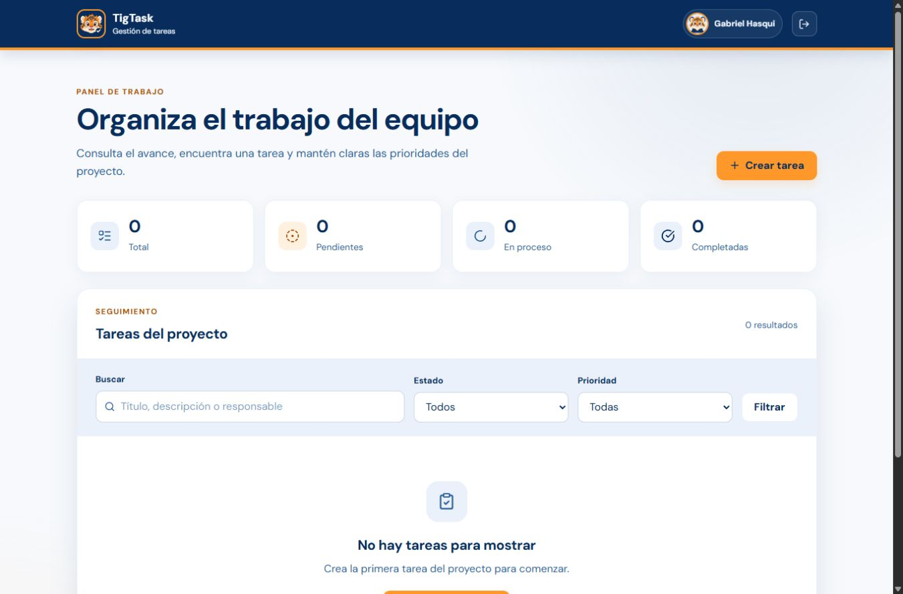
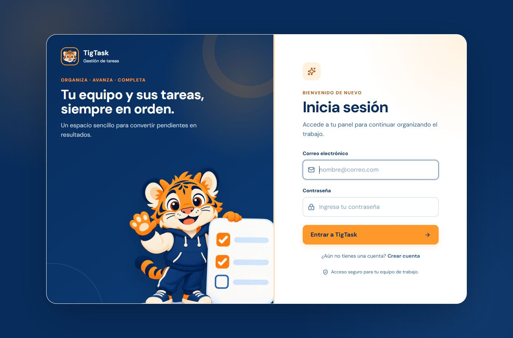
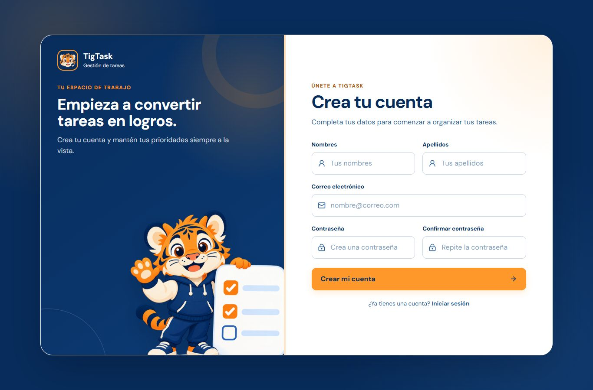
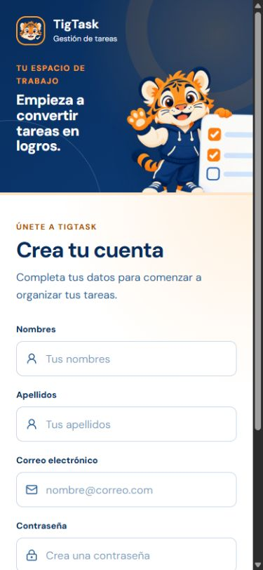

# TigTask - Gestión de Tareas

TigTask es una aplicación web responsiva desarrollada con Django para organizar las tareas de un equipo de software. El proyecto permite aplicar control de versiones, seguimiento de cambios y organización de los elementos de configuración durante una práctica experimental.

## Vista del proyecto

### Panel principal

El panel reúne el resumen de tareas, los filtros de búsqueda y las acciones principales en un solo espacio de trabajo.



### Inicio de sesión

La pantalla de acceso combina la identidad visual de TigTask con un formulario claro para ingresar mediante correo electrónico.



### Registro de usuarios

Los nuevos usuarios pueden crear una cuenta con sus nombres, apellidos, correo y contraseña.



### Dispositivo móvil

La interfaz reorganiza sus elementos para facilitar el uso desde teléfonos y pantallas pequeñas.



## Funcionalidades

- Registro e inicio de sesión mediante correo electrónico.
- Perfil de usuario con nombre abreviado y avatar predeterminado.
- Creación de tareas desde un formulario modal.
- Consulta, edición y eliminación de tareas.
- Clasificación por estado y prioridad.
- Búsqueda por título, descripción o responsable.
- Resumen de tareas totales, pendientes, en proceso y completadas.
- Diseño adaptable a computadoras, tabletas y dispositivos móviles.
- Panel administrativo de Django.

## Tecnologías

- Python 3.12
- Django 5.2
- SQLite
- HTML5
- CSS3 y diseño responsive
- Lucide Icons

## Estructura

```text
tigtask-app/
|-- assets/
|   `-- capturas/
|       |-- inicio-sesion.jpg
|       |-- panel-principal.jpg
|       |-- registro-movil.jpg
|       `-- registro-usuarios.jpg
|-- gestor_tareas/
|   |-- settings.py
|   `-- urls.py
|-- static/
|   |-- css/
|   `-- img/
|-- tareas/
|   |-- migrations/
|   |-- admin.py
|   |-- forms.py
|   |-- models.py
|   |-- tests.py
|   |-- urls.py
|   `-- views.py
|-- templates/
|   |-- registration/
|   `-- tareas/
|-- manage.py
|-- requirements.txt
`-- README.md
```

## Instalación

```powershell
python -m venv .venv
.\.venv\Scripts\Activate.ps1
pip install -r requirements.txt
python manage.py migrate
python manage.py runserver
```

Abrir `http://127.0.0.1:8000/` en el navegador.

## Pruebas

```powershell
python manage.py test
```

## Datos locales

La base de datos, el entorno virtual y los archivos cargados por los usuarios están excluidos del repositorio. Cada instalación comienza con sus propios datos.
